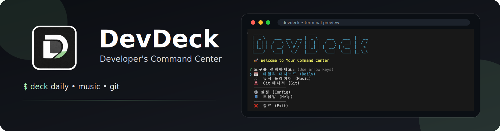
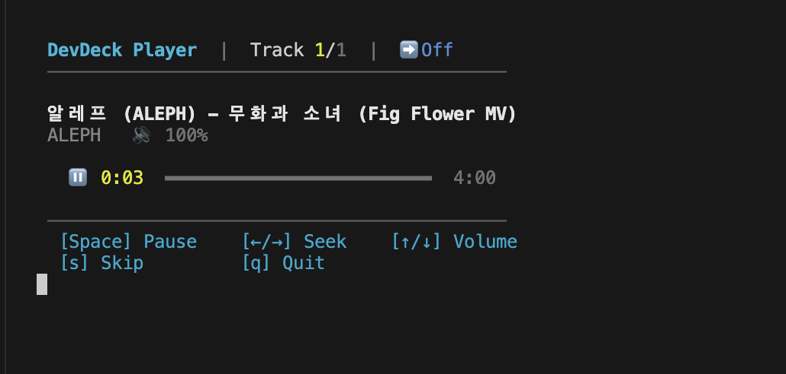
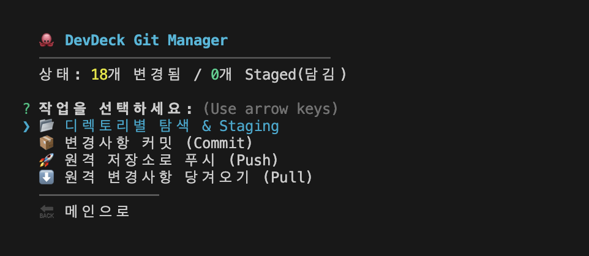
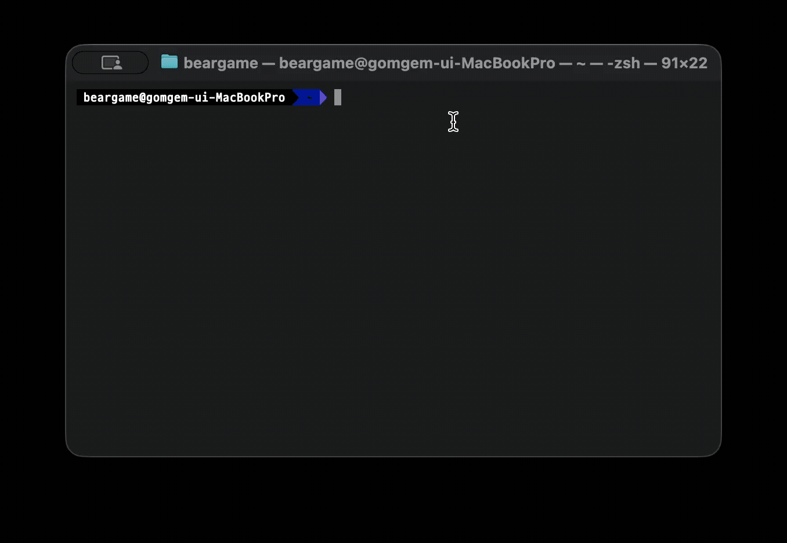

<p align="center">
  
</p>

<p align="center">
  <b>Developer's Command Center</b><br/>
  터미널 안에서 일정, 음악, Git 작업을 한 번에 처리하는 올인원 CLI
</p>

<p align="center">
  <a href="README.md">한국어</a> ·
  <a href="README.en.md">English</a> ·
  <a href="README.ja.md">日本語</a> ·
  <a href="README.zh-CN.md">中文</a>
</p>

<p align="center">
  
  
  
</p>

---

## Preview

| Dashboard | Music | Git Manager |
| :--: | :--: | :--: |
|  |  |  |

<p align="center">
  
</p>

---

## Quick Start

```bash
npm install -g @beargame/devdeck
deck
```

소스 코드 실행:

```bash
git clone https://github.com/KR-Devdeck/devdeck.git
cd devdeck
npm run setup
```

---

## Features

- Daily Dashboard: Todo 확인, 날씨 정보, 개발 명언 표시
- Terminal Jukebox: `mpv` + `yt-dlp` 기반 검색/재생/루프/구간이동
- Git Manager: 다중 파일 스테이징, 스마트 커밋 흐름, `.gitignore` 보조

---

## Commands

| Command | Description |
| :-- | :-- |
| `deck` | 메인 대시보드 실행 |
| `deck m` | 음악 플레이어 바로 실행 |
| `deck g` | Git 매니저 바로 실행 |

---

## Prerequisites

- Node.js `>=18`
- `mpv`
- `yt-dlp`

설치 스크립트가 `mpv`/`yt-dlp` 자동 설치를 시도합니다.

---

## Troubleshooting

- 음악 재생/검색 문제: `mpv --version`, `yt-dlp --version` 확인
- `deck` 명령 미인식: 재설치 후 터미널 재시작
- Windows에서 `mpv`가 남아 있을 때:

```powershell
taskkill /F /IM mpv.exe
```

---

## License

This project is distributed under the **DevDeck Non-Commercial License**.

- Commercial use is not allowed.
- Selling this software is not allowed.
- Monetized distribution is not allowed.
- Redistributed copies must include the license notice.

This is a custom non-commercial license and not an OSI-approved open-source license.
See `LICENSE` and `CONTRIBUTING.md` for details.

<p align="center">
  Made by <b>beargame123</b>
</p>
